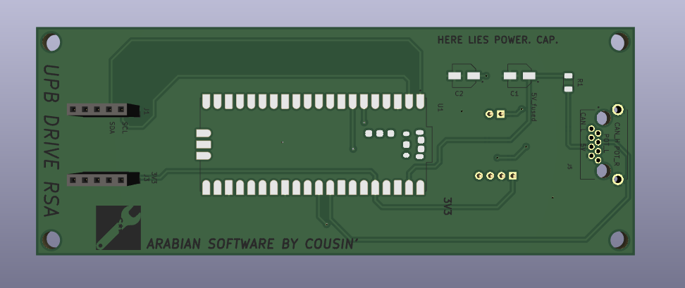

# Rear Sensor Array

## Description
The motivation behind this project was to have an ADC as close as to the analog values
that we needed to measure. 

- ! We faced noise issues with measuring analog values at a distance (more than 10cm)
- It is unfortunately inefficient to have just an ADC because it can't communicate via CAN

In order to accomplish this, we came with this idea of a "sensor array" which integrates a mcu to:
1. communicate via i2c with an accelerometer
2. read via adc linear potentiometers from the coilovers 
3. parse and compress data, if possible, in order to reduce CAN overload
4. send data via CAN bus to another device which would store it 

We chose the Raspberry Pi Pico as a solution because it is cheap and it can handle all the above requirements with the only exception being CAN communication which we have enabled by using an external library which enables PIOs as CAN ready pins.

## What you will find here
- Firmware - contains the source code for the mcu
- Firmware_receiver - contains the source code of a Pico used as CAN receiver (testing purposes)
- Docs - contains the documentation, which you can also find here
- PCB - contains the KiCAD electrical scheme and PCB design files

Please refer the full documentation of the project here.

## How to run this project 
To compile the project, please refer to the Raspberry Pi Pico documentation [here](https://datasheets.raspberrypi.com/pico/getting-started-with-pico.pdf). There you will find how to install the build system on Windows as well as Linux machines.

To see the PCB files, please install KiCAD from [here](https://www.kicad.org/).

<i>Please beware of the jokes on the PCB Soldermask. They are greatly appreciated at Formula Student Comptetitions</i>

## License
Apache-2.0 License

